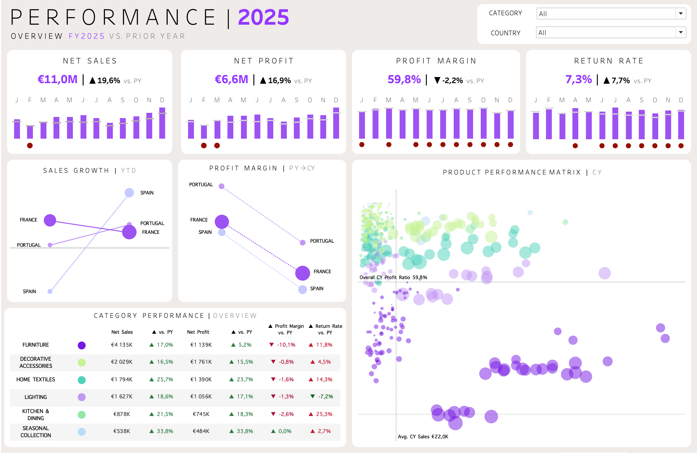

# 01 Sales Performance
> <i>	Revenue Growth & Profitability Analysis</i>

This repository contains the **Sales Performance** project, one of three business-oriented analytical modules within the [**NAVA Business Intelligence Portfolio**](https://github.com/ammflo-ops/NAVA-Business-Intelligence-Portfolio/blob/main/README.md).

Powered by a shared [SQL architecture](https://github.com/ammflo-ops/NAVA-00-Technical-Foundation/blob/main/README.md), the dashboard evaluates revenue growth, profitability and product performance across France, Spain and Portugal, providing stakeholders with actionable insights to support strategic decision-making.

---

# 📖 Overview

## Business Objective

Monitor commercial performance and evaluate whether revenue growth is translating into sustainable profitability across products, countries and business operations.

## Dashboard Overview

The dashboard combines operational KPIs with visual analytics to assess commercial performance from multiple perspectives.

<p align="center">
  
</p>

### Key Performance Indicators

- Net Sales
- Net Profit
- Profit Margin
- Return Rate

### Analytical Focus

- Revenue Growth
- Profitability Evolution
- Product Category Performance
- Product Performance Matrix
---

# 📖 Revenue Growth & Profitability Analysis

## Summary of Insights

- Revenue growth was primarily driven by the Spanish market.
- Profitability declined despite strong sales performance.
- Product categories contributed unevenly to overall business performance.
- Increasing return rates continued to impact profit margins.

## Recommendations & Next Steps

- Improve profitability while sustaining revenue growth.
- Reduce return-related costs in underperforming categories.
- Expand investment in high-performing product categories.
- Monitor margin performance across all markets.

---

# 🛠️ Technical Implementation

**SQL View**

- `vw_sales_net`

**Built With**

- MySQL
- Tableau

The dashboard is powered by the shared SQL architecture available in **00_Technical_Foundation**.

---

# 📂 Project Structure

```text
01_Sales_Performance
│
├── dashboard/
│   ├── sales_performance.twbx
│   └── sales_dashboard.png
│
├── README.md
```
